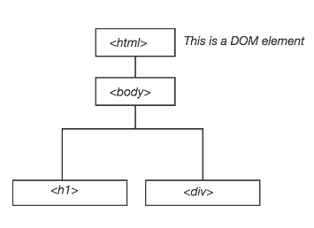

# Front End Environments
## HTML/CSS/JavaScript: An Overview

All the files you will want to use today are provided in the Week 6
folder of the class repo.

In the following steps, we create a blank document, fill it with HTML
code, save it as **index.html**, and view results in our browser. We
will hit on the concepts of HTML, style the page with CSS, and

#### Getting Started

We will work in our github.io pages today, updating and building from
the work we completed in Week 1. Push your files your Github site to
publish your page. If you need a refresher, revisit Week 1 at:

[Week 1 - Intro to Git and Github](https://github.com/civic-data-design-lab/16_11.S947/blob/master/week1/Part1_IntroGitAndGithub.ipynb)

*How is everything related?*


HTML, standing for [HyperText Markup Language](https://en.wikipedia.org/wiki/HTML), organizes the **content**
of your page by creating elements in which your page materials are contained.

### Organize your Directory

The directory in which you keep your website materials should be organized in the following manner.

When a browser requests your page, your server will return the index.html file in the root-directory. The index.html is your 'root'... or 'home'... page.


### HTML: The Core Concepts

All HTML documents start with the following line of code:

```xml
<!DOCTYPE html>
```

Elements of the page are organized by tags. HTML tags are keywords surrounded by angled brackets. This tag states for the browser that the rest of your file will be written in HTML. The rest of our document will follow a very simple rule, no matter how complex the code. When you write a tag (aka start tag), you will need a second tag that declares the end of that part of the document (aka end tag). **Content goes between the start and end tags**.


```xml
<tag>...</tag>
```

Tags without content are called **void elements**.

```xml
<tag />
```

Comments look like the following. They are used to write human-readable notes in your code, but are ignored by the browser.

```xml
<!-- ... -->
```

A basic page, all together, will look like this. This will look awfully similar to week 1. Copy and paste this into a blank text document, and save it in your **github.io** repository as *hello-world.html*.

```xml
<!DOCTYPE html>
<html lang="en">
	<head>
    	<meta charset="utf-8"> 
    	<title>Hello World</title>
	</head>
	<body>
		<!-- This is a comment -->
		<h1>Hello World</h1>
		<div id="main">
			...
		</div>
	</body>
</html>
```

### The DOM: Document Object Model

The [Document Object Model](https://www.w3.org/DOM/) represents the hierarchy of elements in our page. This is modeled using something commonly called the **DOM Tree**, and it consists of our HTML elements.

*The DOM Tree*



#### Common Tags

**Head** and **Body** elements are large containers.

```xml
<!-- HEAD element containing meta information, style, and links -->
<head>
	...
</head>

<!-- BODY element containing all document content elements -->
<body>
	...
</body>
```

**Links, Images** and **Paragraphs**

```xml
<!-- LINKS. A is used to define a hyperlink -->
<a>...</a>


<!-- IMAGE tag to define a link to an image in your document -->


<!-- PARAGRAPH tag for large blocks of body text -->
<p>...</p>

<!-- SPAN is for groups of inline elements -->
<span>...</span>
```

**Lists**
```xml
<!-- UL defines an unordered list -->
<ul>
	<li>...</li> <!-- List element -->
</ul>

<!-- OL defines an ordered list -->
<ol>
	<li>...</li> <!-- List element -->
</ol>

<!-- SPAN is for groups of inline elements -->
<span>...</span>
```

#### DIV Tags

Perhaps the most common tag, the **div** tag defines a division or section of an HTML page. One page can contain many **div** elements, and one **div** element can contain many nested elements. The div tag is an element of HTML that allows you to group content into containers (or divisions) you can organize and style on your web page, and divs play nicely with CSS (Cascading Style Sheets). CSS is a style sheet language used for describing the look and formatting of an HTML page, we will introduce it in the next step.

```xml
<div id="main">
	<!-- Content goes here -->
	...
</div>
```

#### Tag Attributes, Classes, and IDs

Tags are specified and defined using attributes, classes, and IDs. These attributes, classes, and IDs allow you to identify specific elements, modify individual elements and groups of elements, and set the characteristics of the elements.

- *Attributes* define properties of the elements. Elements can have multiple attributes. For example, if the element is a link, where does the link take you.

- *Classes* identify a group of elements that operate similarly or work in the same fashion. For example, a button.

- *IDs* identify unique features and allow for and operations to be performed on that unique feature. In each document, each ID should be unique.

*For Example:*

```xml
<a href="http://www.github.com" class="button" id="unique">...</tag>
```

*or*


```xml
<div style="background-color:#0000FF" class="header" id="main">...</div>
```

Let's get into the document a bit.

#### i. Add Text

Our HTML document is looking bare, we need to add content. We can start by modifying the heading that welcomes visitors to our site and add a couple paragraph elements.

Modify the HTML code on the page to include the following. Add some paragraph **p** elements within the **div** element of your page.

```xml
<p>This is my first paragraph.</p>
<p>This is my second paragraph.</p>
```

The h1 tag signifies a heading, this is a bolded style of text that vary in size ranging from h1 to h6. The p tag signifies a paragraph that can contain large blocks of text. 

#### ii. Add a Link

Adding a link to your site is simple. To add a link, we use the a tag. The a tag defines a hyperlink that can be used to link from one page to another. HTML tags can have attributes. Attributes define and provide additional information about an element. To create a hyperlink, we use the href attribute of the a tag. The following line contains a link to the DUSP home page, and illustrates how you would set up a link. You can place links separate from your paragraphs, or place them within. Write the following line of code at the end your second paragraph, just before the p end tag.

```xml
<a href="http://dusp.mit.edu">Take me to DUSP.</a>
```

*Can you add a link that takes you to Google Maps?*

#### iii. Add an Image

#### Our Code

At present, your document will look something like the following.

```xml
<!DOCTYPE html>
<html lang="en">
	<head>
    	<meta charset="utf-8"> 
    	<title>Hello World</title>
	</head>
	<body>
		<!-- This is a comment -->
		<h1>Hello World</h1>
		<div id="main">
			<p>This is my first paragraph.</p>
			<p>This is my second paragraph. <a href="http://dusp.mit.edu">Take me to DUSP.</a></p>
			
		</div>
	</body>
</html>
```

*What does our DOM Tree look like at this point?*

### Push to Github

Finally, when done with your edits. Commit yourPush your site to Github